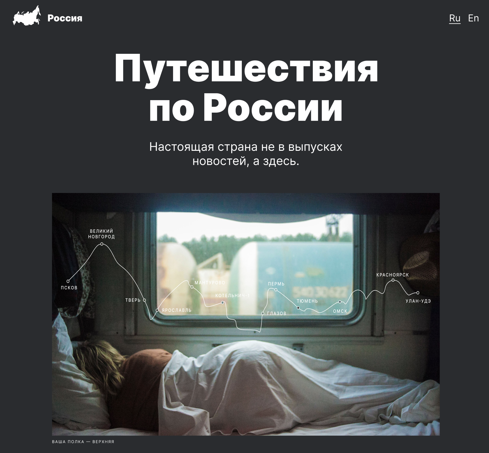

  

# Проект: Путешествие по России

## В данном проекте рассказывается о преимуществах путешесвия по России, все подкреплено фотографиями достопримечательностей разных регионов РФ и указаны основные места, которые следует посетить. Все это очень подкупает путешественников побуждает изучать больше свою страну, нежели другие.

Здесь былы использованы, такие технологии, как:

* флексбокс-верстка;
* bem nested;
* семантические теги;
* grid layout;
* адаптивная верстка;
* работа с Figma;
* работа с Perfect Pixel;
* подключение шрифтов;
* мнемоника.

### Планы по доработке проекта:

- подключить другие шрифты;
- попробовать технологию Mobile first.
